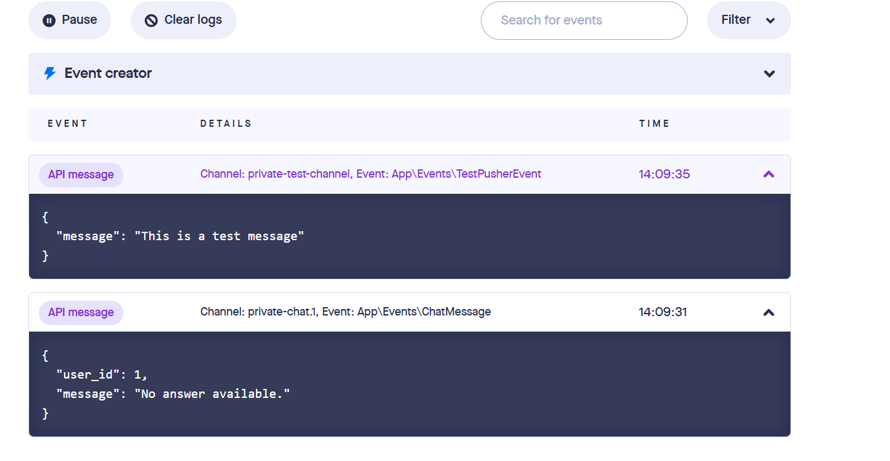

# Mini RAG System with WebSocket Streaming

A Laravel-based Retrieval-Augmented Generation (RAG) system that enables authenticated users to upload PDF documents and interact with an AI assistant through real-time WebSocket connections. The system extracts content from PDFs, processes it for semantic search, and streams AI-generated responses based on the uploaded content.

## 📋 Table of Contents

- [Features](#features)
- [System Architecture](#system-architecture)
- [Technology Stack](#technology-stack)
- [Prerequisites](#prerequisites)
- [Installation](#installation)
- [Configuration](#configuration)
- [Usage Guide](#usage-guide)
- [API Documentation](#api-documentation)
- [WebSocket Implementation](#websocket-implementation)
- [Known Issues & Solutions](#known-issues--solutions)
- [Project Structure](#project-structure)
- [Testing](#testing)
- [Security Considerations](#security-considerations)

## ✨ Features

- **Secure Authentication**: JWT-based authentication using Laravel Sanctum
- **PDF Processing**: Upload, validate, and extract text from PDF documents
- **Real-time Chat**: WebSocket-powered chat interface with streaming responses
- **User-scoped Data**: Each user's uploaded documents are isolated and secure
- **API Versioning**: Clean REST API structure with versioning support
- **Error Handling**: Comprehensive error handling with structured JSON responses
- **Logging**: Built-in logging for debugging and monitoring

## 🏗 System Architecture

### High-Level Overview

```
┌─────────────┐         ┌──────────────┐         ┌─────────────┐
│   Client    │────────▶│  Laravel API │────────▶│  Database   │
│ (Frontend)  │         │   (Backend)  │         │  (MySQL)    │
└─────────────┘         └──────────────┘         └─────────────┘
       │                        │
       │                        │
       │                 ┌──────▼──────┐
       │                 │   Pusher    │
       └────────────────▶│  WebSocket  │
                         └─────────────┘
                                │
                         ┌──────▼──────┐
                         │ LLM/AI API  │
                         │  (OpenAI)   │
                         └─────────────┘
```

### Data Flow

1. **Authentication Flow**:
   - User sends credentials to `/api/v1/auth/login`
   - Server validates and returns JWT token
   - Token is used for all subsequent API and WebSocket requests

2. **PDF Upload Flow**:
   - User uploads PDF to `/api/v1/pdf/upload`
   - System validates file (type, size, integrity)
   - PDF text is extracted using PDF parser
   - Text is chunked into manageable segments
   - Chunks are stored in database with user association
   - *(Note: Embeddings generation is currently using dummy data due to API billing constraints)*

3. **Chat Flow**:
   - User connects to WebSocket with authentication token
   - User sends query through WebSocket channel
   - System retrieves relevant chunks from user's PDFs
   - Context + query sent to LLM API
   - LLM response streamed back to user in real-time via WebSocket

## 🛠 Technology Stack

- **Framework**: Laravel 11.x
- **Authentication**: Laravel Sanctum
- **WebSocket**: Pusher / Laravel Broadcasting
- **Database**: MySQL
- **Vector Database**: Qdrant (via mcpuishor/qdrant-laravel)
- **PDF Processing**: Smalot/PdfParser
- **AI/LLM**: OpenAI API (GPT-3.5-turbo & text-embedding-3-small)
- **PDF Text Extraction**: Poppler (pdftotext binary)
- **PHP**: 8.1+

## 📦 Prerequisites

Before you begin, ensure you have the following installed:

- PHP >= 8.1
- Composer
- MySQL >= 5.7
- Node.js >= 16.x (for frontend dependencies)
- **Poppler Utils** (for PDF text extraction)
  - Windows: Download from [Poppler for Windows](https://github.com/oschwartz10612/poppler-windows/releases/)
  - macOS: `brew install poppler`
  - Linux: `sudo apt-get install poppler-utils`
- **Qdrant Vector Database** (for embeddings storage)
  - Docker: `docker run -p 6333:6333 qdrant/qdrant`
  - Or install locally from [Qdrant Docs](https://qdrant.tech/documentation/quick-start/)

## 🚀 Installation

### 1. Clone the Repository

```bash
git clone https://github.com/halaibrahim867/madar-task.git
cd madar-task
```

### 2. Install Dependencies

```bash
# Install PHP dependencies
composer install

# Install Node dependencies
npm install
```

### 3. Environment Setup

```bash
# Copy environment file
cp .env.example .env

# Generate application key
php artisan key:generate
```

### 4. Configure Database

Edit `.env` file with your database credentials:

```env
DB_CONNECTION=mysql
DB_HOST=127.0.0.1
DB_PORT=3306
DB_DATABASE=rag_system
DB_USERNAME=your_username
DB_PASSWORD=your_password
```

### 5. Run Migrations

```bash
php artisan migrate
```

### 6. Seed Database (Create Test User)

```bash
php artisan db:seed
```

This will create a test user with the following credentials:
- **Email**: `test@example.com`
- **Password**: `password123`
- **Name**: Test User

You can use these credentials to test the authentication and all protected endpoints.

### 7. Storage Setup

```bash
# Create storage link
php artisan storage:link

# Set permissions
chmod -R 775 storage bootstrap/cache
```

## ⚙️ Configuration

### Required Environment Variables

Add the following to your `.env` file:

```env
# Application
APP_NAME=Laravel
APP_ENV=local
APP_DEBUG=true
APP_URL=http://localhost

# Database
DB_CONNECTION=mysql
DB_HOST=127.0.0.1
DB_PORT=3306
DB_DATABASE=madaar_task_db
DB_USERNAME=root
DB_PASSWORD=

# Session & Cache
SESSION_DRIVER=database
CACHE_STORE=database
QUEUE_CONNECTION=sync

# Pusher Configuration (WebSocket)
BROADCAST_CONNECTION=pusher
PUSHER_APP_ID=your_app_id
PUSHER_APP_KEY=your_app_key
PUSHER_APP_SECRET=your_app_secret
PUSHER_APP_CLUSTER=eu
PUSHER_PORT=443
PUSHER_SCHEME=https

# Vite (Frontend)
VITE_PUSHER_APP_KEY="${PUSHER_APP_KEY}"
VITE_PUSHER_APP_CLUSTER="${PUSHER_APP_CLUSTER}"

# OpenAI API (for LLM & Embeddings)
OPENAI_API_KEY=your_openai_api_key

# PDF Processing - Poppler binary path
# Windows example:
PDFTOTEXT_BINARY=D:\laragon\bin\poppler\bin\pdftotext.exe
# macOS/Linux example:
# PDFTOTEXT_BINARY=/usr/local/bin/pdftotext

# Qdrant Vector Database
QDRANT_HOST=http://localhost:6333
QDRANT_API_KEY=null
QDRANT_COLLECTION=pdf_documents
QDRANT_VECTOR_SIZE=1536
QDRANT_DEFAULT=main
```

### Setting Up Pusher

1. Create a free account at [Pusher](https://pusher.com/)
2. Create a new app in your Pusher dashboard
3. Copy your app credentials to `.env` file
4. Update `config/broadcasting.php` if needed

### Setting Up OpenAI

1. Create an account at [OpenAI](https://platform.openai.com/)
2. Generate an API key
3. Add the key to your `.env` file
4. **Note**: This project uses:
   - `gpt-3.5-turbo` for chat completions
   - `text-embedding-3-small` for generating embeddings

### Setting Up Qdrant Vector Database

1. **Using Docker (Recommended)**:
   ```bash
   docker run -p 6333:6333 -v $(pwd)/qdrant_storage:/qdrant/storage qdrant/qdrant
   ```

2. **Verify Qdrant is running**:
   - Open browser and navigate to `http://localhost:6333/dashboard`
   - Or test with: `curl http://localhost:6333`

3. **Test Qdrant connection**:
   ```bash
   curl http://localhost:8000/api/v1/qdrant-test
   ```
   Should return: `Upsert OK`

## 📖 Usage Guide

### Starting the Application

```bash
# Make sure Qdrant is running
docker run -p 6333:6333 qdrant/qdrant

# Start Laravel development server
php artisan serve
```

### Step-by-Step Usage

#### 1. User Login

Use the seeded test user credentials:

**Credentials:**
- Email: `test@example.com`
- Password: `password123`

**Request:**
```bash
POST /api/v1/login
Content-Type: application/json

{
    "email": "test@example.com",
    "password": "password123"
}
```

**Response:**
```json
{
    "success": true,
    "token": "1|abc123def456...",
    "user": {
        "id": 1,
        "name": "Test User",
        "email": "test@example.com"
    }
}
```

**Save the token** - you'll need it for all subsequent requests.

#### 2. Upload PDF Document

**Request:**
```bash
POST /api/v1/pdf/upload
Authorization: Bearer {your_token}
Content-Type: multipart/form-data

{
    "file": [PDF file]
}
```

**Response:**
```json
{
    "message": "PDF uploaded and indexed successfully",
    "pdf_id": 123,
    "chunks": 15
}
```

**Important Notes:**
- Maximum file size: 10MB (10240 KB)
- Only PDF files are accepted
- The PDF is processed automatically:
  - Text extracted using Poppler
  - Split into chunks (150 words with 25-word overlap)
  - Embeddings generated via OpenAI
  - Stored in both MySQL and Qdrant vector database
  - All data is scoped to the authenticated user

#### 3. Send Chat Query and Receive Response

**Request:**
```bash
POST /api/v1/chat/send
Authorization: Bearer {your_token}
Content-Type: application/json

{
    "query": "What is the main topic of the document?"
}
```

**Response:**
```json
{
    "status": "ok",
    "message": "Based on the documents you uploaded, the main topic discusses..."
}
```

**How it works:**
1. Your query is converted to an embedding vector
2. Qdrant searches for the 3 most relevant text chunks from your PDFs
3. Retrieved context + your query sent to GPT-3.5-turbo
4. AI response is returned via API
5. Same response is broadcasted via WebSocket to `private-chat.{userId}`

```javascript
import Echo from 'laravel-echo';
import Pusher from 'pusher-js';

window.Pusher = Pusher;

window.Echo = new Echo({
    broadcaster: 'pusher',
    key: process.env.MIX_PUSHER_APP_KEY,
    cluster: process.env.MIX_PUSHER_APP_CLUSTER,
    forceTLS: true,
    authEndpoint: '/api/v1/broadcasting/auth',
    auth: {
        headers: {
            Authorization: 'Bearer ' + authToken
        }
    }
});

// Subscribe to private chat channel
const channel = window.Echo.private(`chat.${userId}`);

// Listen for chat messages
channel.listen('ChatMessage', (data) => {
    console.log('AI Response:', data.message);
    console.log('User:', data.user);
    // Display the response in your UI
});
```

## 📚 API Documentation

### API Endpoints

| Method | Endpoint | Description | Auth Required |
|--------|----------|-------------|---------------|
| POST | `/api/v1/login` | Login user | No |
| POST | `/api/v1/pdf/upload` | Upload PDF document | Yes |
| POST | `/api/v1/chat/send` | Send chat query | Yes |
| GET | `/api/v1/test-pusher` | Test Pusher broadcasting | No |
| GET | `/api/v1/qdrant-test` | Test Qdrant connection | No |
| POST | `/api/v1/broadcasting/auth` | Authenticate WebSocket | Yes |

### Error Response Format

All API errors follow this structure:

```json
{
    "success": false,
    "message": "Error description",
    "errors": {
        "field": ["Validation error message"]
    }
}
```

### Common HTTP Status Codes

- `200` - Success
- `201` - Resource created
- `400` - Bad request / Validation error
- `401` - Unauthenticated
- `403` - Unauthorized / Forbidden
- `404` - Resource not found
- `422` - Validation failed
- `500` - Server error

## 🔌 WebSocket Implementation

### Current Status: Backend Only

This project has **Pusher WebSocket broadcasting implemented on the backend**, but does not include a frontend consumer. Events are successfully broadcasted and can be monitored via the Pusher Dashboard.

### Pusher Channel Structure

**Private Channels**: Used for user-specific chat
- Format: `private-chat.{userId}`
- Authentication: Required via `/api/v1/broadcasting/auth` endpoint
- Events are broadcasted but not consumed by a frontend yet

### Events

**ChatMessage Event** (`App\Events\ChatMessage`)
```php
// Event structure
{
    "user": {
        "id": 1,
        "name": "Test User",
        "email": "test@example.com"
    },
    "message": "AI generated response text..."
}
```

**TestPusherEvent** (`App\Events\TestPusherEvent`)
```php
// Test event structure  
{
    "message": "This is a test message"
}
```

### Testing WebSocket Connection

You can test the WebSocket using the included test endpoint:

**Test Pusher Event:**
```bash
GET /api/v1/test-pusher
```

**Response:**
```
Broadcast fired
```

This broadcasts a `TestPusherEvent` to the `private-test-channel` with the message "This is a test message".

### Monitoring in Pusher Dashboard

**Live Event Monitoring:**

When you send chat messages or trigger test events, you can see them in real-time:

1. Go to your Pusher dashboard at https://dashboard.pusher.com/
2. Navigate to "Debug Console"
3. Send a request to `/api/v1/chat/send` or `/api/v1/test-pusher`
4. Watch the events appear in real-time

**Example of Events in Dashboard:**

Below is an example showing two events captured in the Pusher Debug Console:



*To add this image to your repository:*
1. Create a `docs` folder in your project root
2. Save your Pusher screenshot as `pusher-events.png` in the `docs` folder
3. The image will display automatically in the README

The screenshot shows:
- **TestPusherEvent**: Broadcasted to `private-test-channel` with message "This is a test message"
- **ChatMessage**: Broadcasted to `private-chat.1` with user data and AI response

You can verify all broadcasts are working correctly by monitoring this console while testing the API.

## 🐛 Known Issues & Solutions

### Issue 1: OpenAI Embeddings API (Billing & Error Handling)

**Problem**: The OpenAI Embeddings API (`text-embedding-3-small`) requires billing to be set up and has usage costs. During development or when API calls fail, the system needs a fallback.

**Current Solution**: The system implements **graceful degradation** with automatic fallback to dummy embeddings:

```php
// EmbeddingService.php
public function embed(string $text): array
{
    try {
        $response = Http::withToken(config('services.openai.api_key'))
            ->post('https://api.openai.com/v1/embeddings', [
                'model' => 'text-embedding-3-small',
                'input' => $text,
            ]);

        if (isset($response['error'])) {
            Log::warning('OpenAI embedding skipped: ' . $response['error']['message']);
            return $this->dummyEmbedding();
        }

        return $response['data'][0]['embedding'] ?? $this->dummyEmbedding();

    } catch (\Throwable $e) {
        Log::warning('OpenAI embedding failed: ' . $e->getMessage());
        return $this->dummyEmbedding();
    }
}

private function dummyEmbedding(): array
{
    return array_fill(0, 1536, 0.01);
}
```

**How it works:**
- System attempts to generate real embeddings using OpenAI API
- If API call fails (billing issue, quota exceeded, network error), it falls back to dummy embeddings
- Dummy embeddings are 1536-dimensional vectors filled with 0.01
- All failures are logged for debugging
- The system continues to function without crashing

**Implications:**
- ✅ **Development**: Works perfectly without API costs
- ✅ **Error Handling**: System never crashes due to API failures  
- ⚠️ **Search Quality**: With dummy embeddings, semantic search is less accurate (all vectors are identical)
- ⚠️ **Production**: Should use real embeddings for optimal RAG performance

**Production Solutions:**

**Production Solutions:**

1. **Enable OpenAI Billing** (Recommended - already implemented)
   - Add payment method to your OpenAI account
   - Set usage limits to control costs
   - The code is already configured to use real embeddings
   - Cost: ~$0.0001 per 1K tokens (very affordable)

2. **Use Alternative Embedding APIs**
   - **Cohere**: Generous free tier, `embed-english-v3.0` model
   - **HuggingFace Inference API**: Free tier available
   - **Voyage AI**: Optimized for retrieval tasks

3. **Local Embeddings** (No API costs)
   - Use `sentence-transformers` via Python
   - Models like `all-MiniLM-L6-v2` (384 dimensions)
   - Integrate via Laravel process execution

### Issue 2: Qdrant Connection

**Problem**: Qdrant must be running for the application to work properly.

**Solution**:
```bash
# Start Qdrant using Docker
docker run -p 6333:6333 -v $(pwd)/qdrant_storage:/qdrant/storage qdrant/qdrant

# Test connection
curl http://localhost:8000/api/v1/qdrant-test
```

If you see "Upsert OK", Qdrant is configured correctly.

### Issue 3: Large PDF Processing

**Problem**: Very large PDFs may timeout during processing.

**Current Implementation**: The system processes PDFs synchronously (no queue system).

**For Production** (if needed):
```env
QUEUE_CONNECTION=database  # or redis
```

Then dispatch jobs to queue and run:
```bash
php artisan queue:work
```

**Note**: The current implementation works well for PDFs up to 10MB processed synchronously.

### Issue 4: Poppler Binary Not Found

**Problem**: Error "pdftotext binary not found"

**Solution**:
1. Install Poppler utilities
2. Update `.env` with correct path:
   ```env
   # Windows (Laragon example)
   PDFTOTEXT_BINARY=D:\laragon\bin\poppler\bin\pdftotext.exe
   
   # macOS
   PDFTOTEXT_BINARY=/usr/local/bin/pdftotext
   
   # Linux  
   PDFTOTEXT_BINARY=/usr/bin/pdftotext
   ```

## 📁 Project Structure

```
madar-task/
├── app/
│   ├── Events/
│   │   ├── ChatMessage.php          # WebSocket chat event
│   │   └── TestPusherEvent.php      # Pusher connection test
│   ├── Http/
│   │   ├── Controllers/
│   │   │   └── Api/V1/
│   │   │       ├── Auth/
│   │   │       │   └── AuthController.php
│   │   │       ├── Chat/
│   │   │       │   └── ChatController.php
│   │   │       └── Pdf/
│   │   │           └── PdfController.php
│   │   └── Middleware/
│   │       └── Authenticate.php
│   ├── Models/
│   │   ├── User.php
│   │   ├── PdfFile.php              # Uploaded PDF metadata
│   │   ├── PdfChunk.php             # Text chunks with embeddings
│   │   └── ChatLog.php              # Chat history
│   ├── Repository/
│   │   ├── ChatRepositoryInterface.php
│   │   ├── PdfChunkRepositoryInterface.php
│   │   ├── PdfFileRepositoryInterface.php
│   │   └── Eloquent/
│   │       ├── ChatRepository.php
│   │       ├── PdfChunkRepository.php
│   │       └── PdfFileRepository.php
│   └── Services/
│       └── Api/V1/
│           ├── Chat/
│           │   └── ChatService.php         # RAG logic
│           └── PDF/
│               ├── PdfService.php          # PDF processing
│               ├── EmbeddingService.php    # OpenAI embeddings
│               └── QdrantService.php       # Vector search
├── config/
│   ├── broadcasting.php
│   ├── services.php
│   └── qdrant-laravel.php
├── database/
│   └── migrations/
├── routes/
│   ├── api.php                      # Main API routes
│   ├── api_v1.php                   # Versioned API routes
│   └── channels.php                 # Broadcast auth
├── storage/
│   └── app/
│       └── private/
│           └── pdfs/                # Uploaded PDFs
├── .env.example
├── composer.json
└── README.md
```

## 🧪 Testing

### Manual Testing Flow

1. **Test Qdrant Connection:**
```bash
curl http://localhost:8000/api/v1/qdrant-test
# Expected: "Upsert OK"
```

2. **Test Pusher Broadcasting:**
```bash
curl http://localhost:8000/api/v1/test-pusher
# Expected: "Broadcast fired"
# Check Pusher dashboard for the event
```

3. **Test Authentication:**
```bash
curl -X POST http://localhost:8000/api/v1/login \
  -H "Content-Type: application/json" \
  -d '{"email":"test@example.com","password":"password"}'
```

4. **Test PDF Upload:**
```bash
curl -X POST http://localhost:8000/api/v1/pdf/upload \
  -H "Authorization: Bearer {token}" \
  -F "file=@/path/to/sample.pdf"
```

5. **Test Chat Query:**
```bash
curl -X POST http://localhost:8000/api/v1/chat/send \
  -H "Authorization: Bearer {token}" \
  -H "Content-Type: application/json" \
  -d '{"query":"What is this document about?"}'
```

### Automated Tests

```bash
# Run all tests
php artisan test

# Run specific test suite
php artisan test --testsuite=Feature
```

### Debugging Tips

1. **Check Laravel logs:**
   ```bash
   tail -f storage/logs/laravel.log
   ```

2. **Monitor Qdrant:**
   - Dashboard: `http://localhost:6333/dashboard`
   - Collections: `http://localhost:6333/collections`

3. **Monitor Pusher:**
   - Login to Pusher dashboard at https://dashboard.pusher.com/
   - Go to "Debug Console"
   - Watch events in real-time as you test the API
   - You should see `TestPusherEvent` and `ChatMessage` events appearing

## 📊 System Features & Limitations

### ✅ Implemented Features

- ✅ **Authentication**: JWT token-based via Laravel Sanctum
- ✅ **PDF Upload**: Multi-format validation with 10MB limit
- ✅ **Text Extraction**: Using Poppler pdftotext binary
- ✅ **Text Chunking**: 150-word chunks with 25-word overlap
- ✅ **Embeddings**: OpenAI text-embedding-3-small with fallback
- ✅ **Vector Storage**: Qdrant for semantic search
- ✅ **RAG System**: Context retrieval + GPT-3.5-turbo completion
- ✅ **WebSocket Broadcasting**: Pusher backend implementation
- ✅ **User-scoped Data**: All PDFs and chunks isolated per user
- ✅ **Error Handling**: Comprehensive logging and graceful degradation
- ✅ **Test Endpoints**: Qdrant and Pusher connectivity tests

### ⚠️ Current Limitations

- ⚠️ **No Frontend**: WebSocket events broadcasted but not consumed
- ⚠️ **Synchronous Processing**: PDFs processed in real-time (no queue)
- ⚠️ **Single User Seed**: Only one test user provided
- ⚠️ **No PDF Management**: Cannot list or delete uploaded PDFs (yet)
- ⚠️ **No Chat History**: Conversations not persisted (yet)

## 🔒 Security Considerations

### Implemented Security Measures

1. **Authentication**: All API endpoints and WebSocket connections require valid authentication tokens
2. **Authorization**: Users can only access their own uploaded documents
3. **Input Validation**: All inputs are validated and sanitized
4. **File Upload Security**:
   - MIME type validation
   - File size limits
   - Extension whitelist
   - Stored outside public directory
5. **SQL Injection Prevention**: Using Eloquent ORM with parameter binding
6. **XSS Protection**: Laravel's built-in protection mechanisms
7. **CSRF Protection**: Enabled for web routes
8. **Rate Limiting**: API rate limiting configured

### Best Practices for Production

- Use HTTPS for all connections
- Enable production-grade logging and monitoring
- Implement proper error tracking (Sentry, Bugsnag)
- Use environment-specific configurations
- Regular security audits and dependency updates
- Implement request rate limiting
- Use queue workers for heavy processing

## 📝 Development Notes

### Design Decisions

1. **Why Laravel Sanctum?** Lightweight, simple token-based authentication perfect for SPAs and APIs
2. **Why Pusher?** Reliable WebSocket service with easy Laravel integration and generous free tier
3. **Why Qdrant?** Purpose-built vector database with excellent Laravel integration via `mcpuishor/qdrant-laravel`
4. **Why Graceful Degradation for Embeddings?** Allows development without API costs while maintaining production-ready architecture
5. **Why Repository Pattern?** Separates data access logic from business logic, making code more testable and maintainable
6. **API Versioning**: Future-proofs the API for breaking changes (`/api/v1/...`)
7. **Text Chunking Strategy**: 150 words with 25-word overlap balances context preservation with retrieval accuracy

### Code Quality

The project follows:
- **SOLID principles**: Single Responsibility, Dependency Injection
- **Repository Pattern**: Clean separation of concerns
- **Service Layer Architecture**: Business logic isolated from controllers
- **Clean Code practices**: Descriptive naming, small functions
- **PSR-12 coding standards**: Laravel community conventions
- **RESTful API conventions**: Proper HTTP methods and status codes
- **Laravel best practices**: Eloquent ORM, form validation, middleware

## 🤝 Contributing

This is a task submission project. For any questions or suggestions, please contact the repository owner.

## 📄 License

This project is created as a technical assessment for Madaar Solutions.

## 👤 Author

**Hala Ibrahim**
- GitHub: [@halaibrahim867](https://github.com/halaibrahim867)

## 🙏 Acknowledgments

- Madaar Solutions for the interesting technical challenge
- Laravel community for excellent documentation
- OpenAI for the GPT and Embeddings API
- Qdrant team for the powerful vector database
- mcpuishor for the excellent Laravel-Qdrant integration package

---

**Note**: This project was developed as part of a technical assessment. The system implements robust error handling with automatic fallback to dummy embeddings when OpenAI API calls fail, ensuring the application remains functional during development and handles production errors gracefully.
